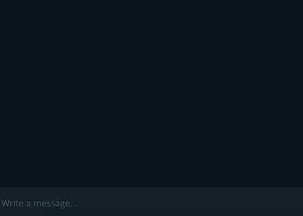
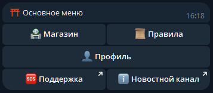
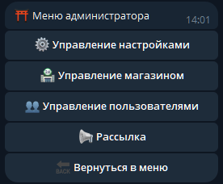
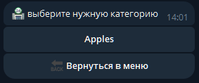
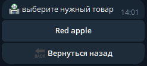

# Telegram shop
This is an example Telegram shop bot.
this is a fairly simple template, but at the same time it is quite effective for selling something directly in the telegram  
## Example:  
### admin pov  

### user pov:

## What can it do?
- `/start` - needed to start the bot
### Menu
  the menu for the user looks like this (the administrator has an "admin panel" button in the menu):  
    
  
### Catalog
  The catalog consists of categories and positions. The user can buy goods from the positions, and the administrator can manage them  
    
    
  
### Other
  The bot has configured logging that reports errors or actions of administrators  
## Tech Stack 💻
- #### Languages:
  - Python 3.10

- #### Telegram:
    - Aiogram

- #### Database:
    - SQLite3
    - Sqlalchemy

- #### Payment:
    - Yoomoney

- #### Debug:
    - logger

## Installation 💾
[QUICK START](markdown/quick_start.md)